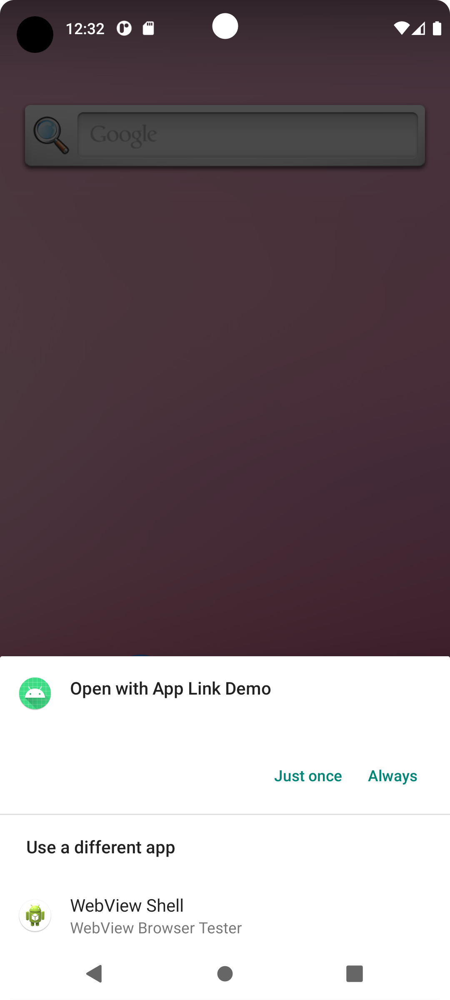

# App Link Demo

A simple app to demonstrate how to use Android App Links

<p align="center">
  
</p>

## How to test

1. Run the app
2. Minimize or close it
3. From your terminal type the following adb command
```
adb shell am start -W -a android.intent.action.VIEW -d "https://marcelobenedito.github.io/appdemolink/test"
```

_NOTE: Android API higher than 30 (Android 11) will not work. It's required to make the link verification before_